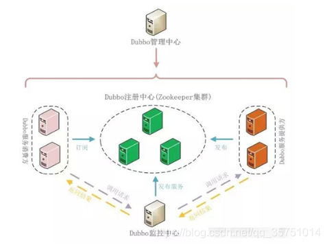
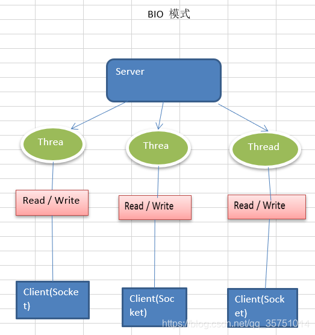
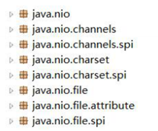
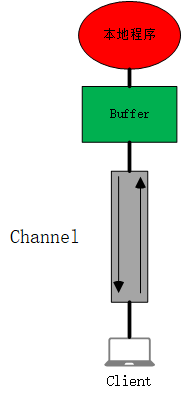
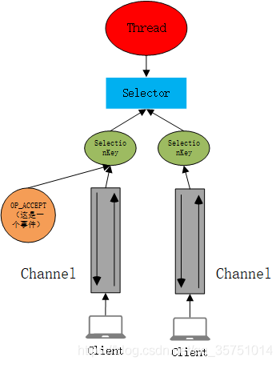
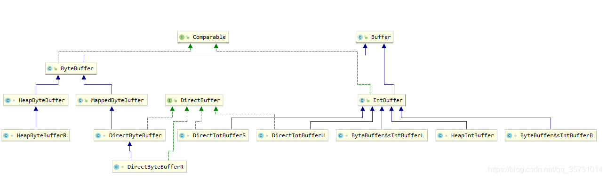
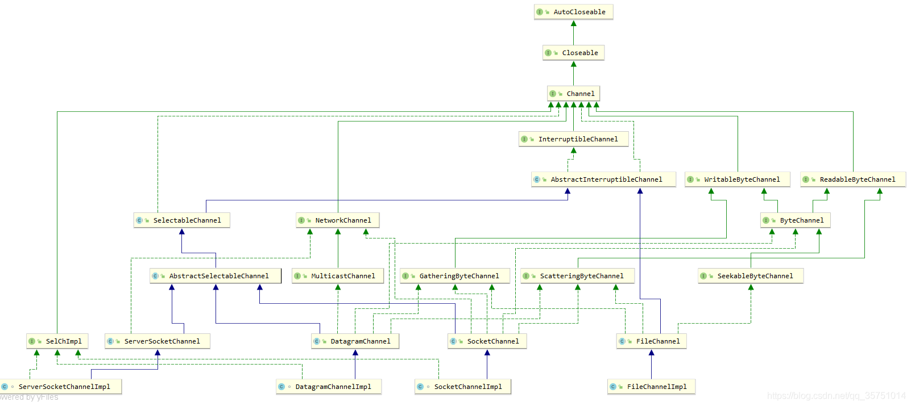
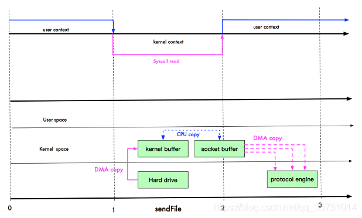
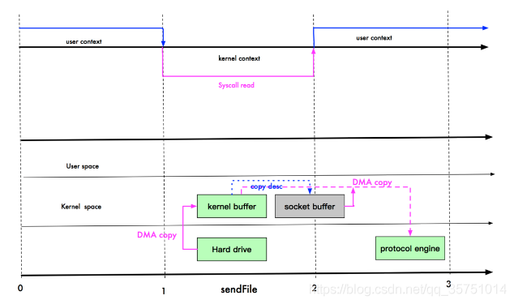

Netty  - 学习 b站 20201205

from CSDN 没有 学习完

(参考)网站：  [netty 学习笔记](https://blog.csdn.net/qq_35751014/category_9722459.html)

# 一、Java IO概述

## 1、Netty介绍和应用场景

### 1.1、Netty介绍

1. `Netty`是由`JBOSS`提供的一个`Java`开源框架，现为`Github`上的独立项目
2. `Netty`是一个异步的、**基于事件驱动**的网络应用框架，用以快速开发高性能、高可靠性的网络`IO`程序
3. `Netty`主要针对在`TCP`协议下，面向`Clients`端的高并发应用，或者`Peer-to-Peer`场景下的大量数据持续传输的应用。
4. `Netty`本质是一个`NIO`框架，适用于服务器通讯相关的多种应用场景
5. 要透彻理解`Netty` ， 需要先学习 `NIO` ， 这样我们才能阅读 `Netty` 的源码。

### 1.2、Netty的应用场景

- 互联网行业
  - 分布式系统中，各个节点之间需要远程服务调用，高性能的`RPC`框架必不可少，`Netty`作为异步高性能的通信框架，往往作为基础通信组件被这些`RPC`框架使用
  - 典型的应用有：阿里分布式服务框架`Dubbo`的`RPC`框架使用`Dubbo`协议进行节点间通信，`Dubbo`协议进行节点间通信，`Dubbo`协议默认使用`Netty`作为基础通信组件，用于实现各进程节点之间的内部通信
- 游戏行业
  - 无论是手游服务端还是大型的网络游戏，`Java` 语言得到了越来越广泛的应用
  - `Netty` 作为高性能的基础通信组件，提供了 `TCP/UDP` 和 `HTTP` 协议栈，方便定制和开发私有协议栈，账号登录服务器
  - 地图服务器之间可以方便的通过 `Netty` 进行高性能的通信
- 大数据领域
  - 经典的 `Hadoop`的高性能通信和序列化组件`Avro` 的 `RPC` 框架，默认采用 `Netty` 进行跨界点通信
  - 它的 `Netty Service` 基于 `Netty` 框架二次封装实现。
    

## 2、Java IO模型介绍

### 2.1、I/O模型基本说明

- `I/O` 模型简单的理解：就是用什么样的通道进行数据的发送和接收，很大程度上决定了程序通信的性能
- `Java`共支持3种网络编程模型IO模式：`BIO、NIO、AIO`
- `Java BIO` ： 同步并阻塞(**传统阻塞型**)，服务器实现模式为一个连接一个线程，即客户端有连接请求时服务器端就需要启动一个线程进行处理，如果这个连接不做任何事情会造成不必要的线程开销
  
- `Java NIO` ： **同步非阻塞**，服务器实现模式为一个线程处理多个请求(连接)，即客户端发送的连接请求都会注册到多路复用器上，多路复用器轮询到连接有`I/O`请求就进行处理
  
- `Java AIO(NIO.2)` ： **异步非阻塞**，`AIO` 引入异步通道的概念，采用了 `Proactor` 模式，简化了程序编写，有效的请求才启动线程，它的特点是先由操作系统完成后才通知服务端程序启动线程去处理，一般适用于连接数较多且连接时间较长的应用

### 2.2、I/O模型使用场景分析

- `BIO`方式适用于**连接数目比较小且固定**的架构，这种方式对服务器资源要求比较高，并发局限于应用中，`JDK1.4`以前的唯一选择，但程序简单易理解。
- `NIO`方式适用于**连接数目多且连接比较短**（轻操作）的架构，比如聊天服务器，弹幕系统，服务器间通讯等。编程比较复杂，`JDK1.4`开始支持。
- `AIO`方式使用于**连接数目多且连接比较长**（重操作）的架构，比如相册服务器，充分调用OS参与并发操作，编程比较复杂，`JDK7`开始支持。

## 3、BIO 工作机制


### 3.1、BIO编程简单流程（Socket编程）

- 服务器端启动一个`ServerSocket`
- 客户端启动`Socket`对服务器进行通信，默认情况下服务器端需要对每个客户 建立一个线程与之通讯
- 客户端发出请求后, 先咨询服务器是否有线程响应，如果没有则会等待，或者被拒绝
- 如果有响应，客户端线程会等待请求结束后，在继续执行

### 3.2、BIO 应用实例

#### 实例说明

- 使用`BIO`模型编写一个服务器端，监听`6666`端口，当有客户端连接时，就启动一个线程与之通讯。
- 要求使用线程池机制改善，可以连接多个客户端.
- 服务器端可以接收客户端发送的数据(通过`cmd`的`telnet` 方式即可)。

#### 实例代码

```java
public class BIOServer {
    public static void main(String[] args) throws IOException {
        //1、创建一个线程池
        //2、如果有客户端连接，就创建一个线程，与之通讯（单独写一个方法）
        ExecutorService executorService = Executors.newCachedThreadPool();

        //创建ServerSocket
        ServerSocket serverSocket = new ServerSocket(6666);
        System.out.println("服务器启动了");

        while (true) {
            System.out.println("线程信息：id= "+ Thread.currentThread().getId() + "; 线程名字：" + Thread.currentThread().getName());
            //监听，等待客户端连接
            System.out.println("等待连接");
            final Socket socket = serverSocket.accept();
            System.out.println("连接到一个客户端");

            //创建一个线程，与之通讯
            executorService.execute(() -> {
                //重写Runnable方法，与客户端进行通讯
                handler(socket);
            });
        }
    }

    //编写一个Handler方法，和客户端通讯
    public static void handler(Socket socket) {
        try {
            System.out.println("线程信息：id= "+ Thread.currentThread().getId() + "; 线程名字：" + Thread.currentThread().getName());
            byte[] bytes = new byte[1024];
            //通过socket获取输入流
            InputStream inputStream = socket.getInputStream();
            //循环的读取客户端发送的数据
            while (true){
                System.out.println("线程信息：id= "+ Thread.currentThread().getId() + "; 线程名字：" + Thread.currentThread().getName());
                System.out.println("read....");
                int read = inputStream.read(bytes);
                if (read != -1){
                    System.out.println(new String(bytes, 0, read));//输出客户端发送的数据
                } else {
                    break;
                }
            }
        } catch (IOException e) {
            e.printStackTrace();
        } finally {
            System.out.println("关闭和client的连接");
            try {
                socket.close();
            } catch (IOException e) {
                e.printStackTrace();
            }
        }
    }
}
12345678910111213141516171819202122232425262728293031323334353637383940414243444546474849505152535455
```

> 服务端主线程会阻塞在 `serverSocket.accept()` 这个方法处，当有新的客户端发起请求时，主线程通过线程池调用新线程与其通信，每个通信线程会阻塞在 `socket.getInputStream()`这个方法处。这就是**阻塞**这两个字的含义所在

#### BIO 问题分析

- 每个请求都需要创建独立的线程，与对应的客户端进行数据 `Read`，业务处理，数据 `Write` 。
- 当并发数较大时，需要**创建大量线程来处理连接**，系统资源占用较大。
- 连接建立后，如果当前线程暂时没有数据可读，则线程就阻塞在 `Read` 操作上，造成线程资源浪费

## 4、NIO编程

### 4.1、NIO基本介绍

- Java NIO 全称 `java non-blocking IO`，是指 JDK 提供的新 API。从 JDK1.4 开始，Java 提供了一系列改进的输入/输出的新特性，被统称为 NIO(即 New IO)，是**同步非阻塞**的
- NIO 相关类都被放在 `java.nio` 包及子包下，并且对原 `java.io` 包中的很多类进行改写。
  
- NIO 有三大核心部分：**Channel(通道)**，**Buffer(缓冲区)**, **Selector(选择器)**
- NIO是 面向**缓**冲区 ，或者面向 **块** 编程的。数据读取到一个它稍后处理的缓冲区，需要时可在缓冲区中前后移动，这就增加了处理过程中的灵活性，使用它可以提供**非阻塞**式的高伸缩性网络
- `Java NIO`的非阻塞模式，使一个线程从某通道发送请求或者读取数据，但是它仅能得到目前可用的数据，如果目前没有数据可用时，就什么都不会获取，而**不是保持线程阻塞**，所以直至数据变的可以读取之前，该线程可以继续做其他的事情。 非阻塞写也是如此，一个线程请求写入一些数据到某通道，但不需要等待它完全写入，这个线程同时可以去做别的事情。
- 通俗理解：`NIO`是可以做到用一个线程来处理多个操作的。假设有`10000`个请求过来,根据实际情况，可以分配`50`或者`100`个线程来处理。不像之前的阻塞`IO`那样，非得分配`10000`个。
- `HTTP2.0`使用了多路复用的技术，做到同一个连接并发处理多个请求，而且并发请求的数量比`HTTP1.1`大了好几个数量级。

### 4.2、NIO 和 BIO 的比较

- `BIO` 以流的方式处理数据,而 `NIO` 以块的方式处理数据,块 `I/O` 的效率比流 `I/O` 高很多
- `BIO` 是阻塞的，`NIO` 则是非阻塞的
- `BIO`基于字节流和字符流进行操作，而 `NIO` 基于 Channel(通道)和 Buffer(缓冲区)进行操作，数据总是从通道读取到缓冲区中，或者从缓冲区写入到通道中。**Selector**(选择器)用于监听多个通道的事件（比如：连接请求，数据到达等），因此使用**单个线程就可以监听多个客户端**通道


# 二、NIO详解

**关键词：Buffer、Channel、SelectionKey、Selector、事件**

**Buffer：**

- 缓存数组，就是一个内存块，底层用数组实现
- 与`Channel`进行数据的读写。
- 数据的读取写入是通过`Buffer`, 这个和`BIO` 一样, 而`BIO` 中要么是输入流，或者是输出流, 不能双向，但是`NIO`的`Buffer` 是可以读也可以写, 需要 `flip` 方法切换。

**Channel：**

- 通信通道，每个客户端连接都会建立一个`Channel`通道
- 我的理解是：客户端直接与`Channel`进行通信，当客户端发送消息时，消息就流通到`Channel`里面，本地程序需要将`Channel`里面的数据存放在`Buffer`里面，才可以查看；当本地需要发送消息时，先把消息存在`Buffer`里面，再将`Buffer`里面的数据放入`Channel`，数据就流通到了客户端
- 总而言之：`Buffer`就是本地程序与`Channel`数据交换的一个中间媒介。
  
  **SelectionKey、Selector：**
- NIO之所以是非阻塞的，关键在于它一个线程可以同时处理多个客户端的通信。而`Selector`就是它一个线程如何处理多个客户端通信的关键，一个`Selector`就对应一个线程
- 首先在创建与客户端连接的`Channel`时，应该调用 `Channel.register()`方法，将Channel注册到一个`Selector`上面。调用该方法后，会返回一个`SelectionKey`对象，该对象与`Channel`是一一对应的。而`Selector`则通过管理`SelectionKey`的集合间接的去管理各个`Channel`。示例图如下：
  
- `Selector`具体是如何管理这么多个通信的呢？这就引出了**事件**。

**事件、以及NIO的工作流程介绍**

- **事件：**当将`Channel`绑定到`Selector`上面时，必须同时为该`Channel`声明一个监听该`Channel`的事件（由`Channel`和该`Channel的事件`一起组成了`SelectionKey`），并将`SelectionKey`加入到`Selector`的`Set`集合中去
- 当有客户端建立连接或者进行通信，会在对应的各个`Channel`中产生不同的事件。
- `Selector`会一直监听所有的事件，当他监听到某个`SelectionKey`中有事件产生时，会将所有产生事件的`SelectionKey`统一加入到一个集合中去
- 而我们则需要获取到这个集合，首先对集合中的各个`SelectionKey`进行判断，判断它产生的是什么事件，再根据不同的事件进行不同的处理。
- 在操作这个`SelectionKey`集合的时候，其实我们就是在一个线程里面对几个不同客户端的连接进行操作。具体的关系图如下：
  

## 1、缓冲区（Buffer）

### 1.1、基本介绍

 缓冲区（Buffer）：缓冲区本质上是一个可以读写数据的内存块，可以理解成是一个容器对象（含数组），该对象提供了一组方法，可以更轻松地使用内存块，缓冲区对象内置了一些机制，能够跟踪和记录缓冲区的状态变化情况。`Channel`提供从文件、网络读取数据的渠道，但是读取或写入的数据都必须经由`Buffer`。


### 1.2、Buffer类介绍


- 基类是`Buffer`抽象类
- 基类派生出基于基本数据类型的7个`xxxBuffer` 抽象类，没有`boolean`相关的`buffer`类。
- 除了`ByteBuffer`外，每个基本数据的抽象类 `xxxBuffer` 类下面都派生出转向 `ByteBuffer` 的类 `ByteBufferXxxAsBufferL` 和 `ByteBufferAsXxxBufferB`实现类；以及 `DirectXxxBufferU` 和 `DirectXxxBufferS` 和 `HeapXxxBuffer`==（具体实例对象类）==这五个类。
- 就只有抽象类`CharBuffer` 派生出了第六个类`StringCharBuffer`。
- `ByteBuffer`只派生出了 `HeapByteBuffer` 和 `MappedByteBufferR` 两个类
- 类图如下：
  

#### 1.2.1、Buffer类主要属性

| **属性** | **描述**                                                     |
| -------- | ------------------------------------------------------------ |
| Capacity | 容量，即可以容纳的最大数据量；在缓冲区创建时被设定并且不能改变 |
| Limit    | 表示缓冲区的当前终点，不能对缓冲区超过极限的位置进行读写操作。且极限是可以修改的 |
| Position | 位置，下一个要被读或写的元素的索引，每次读写缓冲区数据时都会改变改值，为下次读写作准备 |
| Mark     | 标记 ，一般不会主动修改，在`flip()`被调用后，mark就作废了。  |

> mark <= position <= limit <= capacity

#### 1.2.2、Buffer类使用示例

```java
//创建一个Buffer，大小为5，即可以存放5个int
IntBuffer intBuffer = IntBuffer.allocate(5);
//向buffer中存放数据
for (int i = 0; i < intBuffer.capacity(); i++) {
    intBuffer.put(i * 2);
}
//如何从buffer中读取数据
//将buffer转换，读写切换
intBuffer.flip();
while (intBuffer.hasRemaining()) {
    System.out.println(intBuffer.get());
}
123456789101112
```

- `Buffer` 刚创建时，`capacity = 5` ，固定不变。`limit`指针指向`5`，`position`指向`0`，`mark`指向`-1`
- 之后调用 `intBuffer.put`方法，向`buffer`中添加数据，会不断移动`position`指针，最后`position`变量会和`limit`指向相同。
- 调用 `buffer.flip()`实际上是重置了`position`和`limit`两个变量，将`limit`放在`position`的位置，`position`放在`0`的位置。这里只是最后的`position`和`limit`位置相同，所以`flip`后`limit`位置没变。
  
- 调用 `intBuffer.get()`实际上是不断移动`position`指针，直到它移动到`limit`的位置

#### 1.2.3、Buffer类主要方法

##### Buffer基类（抽象类）

- `public final int capacity();`
  - 直接返回了此缓冲区的容量，`capacity`
- `public final int position();`
  - 直接返回了此缓冲区指针的当前位置
- `public final Buffer position(int newPosition);`
  - 设置此缓冲区的位置，设置`position`
- `public final int limit();`
  - 返回此缓冲区的限制
- `public final Buffer limit(int newLimit);`
  - 设置此缓冲区的限制，设置`limit`
- `public final Buffer clear();`
  - 清除此缓冲区，即将各个标记恢复到初识状态， `position = 0;limit = capacity; mark = -1`，但是并没有删除数据。
- `public final Buffer flip();`
  - 反转此缓冲区， `limit = position;position = 0;mark = -1`。
  - 当指定数据存放在缓冲区中后，`position`所指向的即为此缓冲区数据最后的位置。只有当数据大小和此缓冲区大小相同时，`position`才和`limit`的指向相同。
  - `flip()`方法将`limit`置向`position`， `position`置`0`，那么从`position`读取数据到`limit`即为此缓冲区中所有的数据。
- `public final boolean hasRemaining();`
  - 告知当前位置和限制之间是否有元素。`return position < limit;`
- `public abstract boolean isReadOnly();`
  - 此方法为抽象方法，告知此缓冲区是否为只读缓冲区，具体实现在各个实现类中。
- `public abstract boolean hasArray();`
  - 告知此缓冲区是否具有可访问的底层实现数组
- `public abstract Object array();`
  - 返回此缓冲区的底层实现数组

##### Buffer具体实现类（ByteBuffer为例）

 从前面可以看出来对于Java中的基本数据类型（**boolean除外**），都有一个`Buffer`类型与之对应，最常用的自然是`ByteBuffer`类（二进制数据），该类的主要方法如下：

- `public static ByteBuffer allocateDirect(int capacity);`

  - 创建直接缓冲区

- `public static ByteBuffer allocate(int capacity) ;`

  - 设置缓冲区的初识容量

- `public abstract byte get();`

  - 从当前位置`position`上`get`数据，获取之后，`position`会自动加`1`

- `public abstract byte get(int index);`

  - 通过绝对位置获取数据。

- `public abstract ByteBuffer put(byte b);`

  - 从当前位置上添加，`put`之后，`position`会自动加`1`

- `public abstract ByteBuffer put(int index, byte b);`

  - 从绝对位置上添加数据

- `public abstract ByteBuffer putXxx(Xxx value [, int index]);`

  - 从`position`当前位置插入元素。`Xxx`表示基本数据类型

  - 此方法时类型化的 `put` 和 `get`，`put`放入的是什么数据类型，`get`就应该使用相应的数据类型来取出，否则可能有 `BufferUnderflowException` 异常。

  - 示例如下：

    ```java
    ByteBuffer buf = ByteBuffer.allocate(64);
    
    //类型化方式放入数据
    buf.putInt(100);
    buf.putLong(20);
    buf.putChar('上');
    buf.putShort((short)44);
    
    //取出，当取出的顺序和上面插入的数据类型的顺序不对时，就会抛出BufferUnderflowException异常
    buf.flip();
    System.out.println(buf.getInt());
    System.out.println(buf.getLong());
    System.out.println(buf.getChar());
    System.out.println(buf.getShort());
    1234567891011121314
    ```

- 可以将一个普通的Buffer转成只读的Buffer

  ```java
  //创建一个Buffer
  ByteBuffer byteBuffer = ByteBuffer.allocate(64);
  for (int i = 0; i < 64; i++) {
      byteBuffer.put((byte)i);
  }
  //读取
  byteBuffer.flip();
  //得到一个只读的Buffer
  ByteBuffer readOnlyBuffer = byteBuffer.asReadOnlyBuffer();
  System.out.println(readOnlyBuffer.getClass());
  //读取
  while (readOnlyBuffer.hasRemaining()){
      System.out.println(readOnlyBuffer.get());
  }
  readOnlyBuffer.put((byte)100); //会抛出 ReadOnlyBufferException
  123456789101112131415
  ```

- `MappedByteBuffer`可以让文件直接在内存（堆外内存）中进行修改，而如何同步到文件由NIO来完成

  ```java
  /**
  * 1、MappedByteBuffer可以让文件直接在内存中（堆外内存）修改，操作系统不需要拷贝一次
  */
  @Test
  public void test() throws IOException {
      RandomAccessFile randomAccessFile = new RandomAccessFile("1.txt", "rw");
      //获取对应的文件通道
      FileChannel channel = randomAccessFile.getChannel();
      /**
      * 参数1: FileChannel.MapMode.READ_WRITE，使用的读写模式
      * 参数2: 0，可以直接修改的起始位置
      * 参数3: 5，是映射到内存的大小(不是文件中字母的索引位置），即将 1.txt 的多少个字节映射到内存，也就是可以直接修改的范围就是 [0, 5)
      * 实际的实例化类型：DirectByteBuffer
      */
      MappedByteBuffer mappedByteBuffer = channel.map(FileChannel.MapMode.READ_WRITE, 0, 5);
  
      mappedByteBuffer.put(0,(byte)'N');
      mappedByteBuffer.put(3, (byte)'M');
      mappedByteBuffer.put(5, (byte)'Y'); //会抛出 IndexOutOfBoundsException
  
      randomAccessFile.close();
      System.out.println("修改成功~");
  }
  1234567891011121314151617181920212223
  ```

## 2、通道（Channel）

### 2.1、基本介绍

- NIO的通道类似于流，但有些区别
  - 通道可以同时进行读写，而流只能读或者只能写
  - 通道可以实现异步读写数据
  - 通道可以从缓存读数据，也可以写数据到缓存
    
- BIO 中的 `stream` 是单向的，例如：`FileInputStream`对象只能进行读取数据的操作，而NIO中的通道（Channel）是双向的，可以读操作，也可以写操作。
- `Channel` 在 NIO 中是一个接口：`public interface Channel extends Closeable{}`
- 常用的`Channel`类有：`FileChannel`、`DatagramChannel`、`ServerSocketChannel`（类似`ServerSocket`）、`SocketChannel`（类似`Socket`）
- `FileChannel` 用于**文件**数据的读写，`DatagramChannel`用于**UDP**数据的读写，`ServerSocketChannel`和`SocketChannel`用于**TCP**数据读写
- 类关系图：
  

### 2.2、FileChannel类

#### 常见方法

- ```
  public int read(ByteBuffer dst)
  ```

  - 从通道读取数据并放到缓冲区中
  - 此操作也会移动 `Buffer` 中的`position`指针，不断往`position`中放数据，`read`完成后`position`指向`limit`。

- ```
  public int write(ByteBuffer src)
  ```

  - 把缓冲区的数据写到通道中
  - 此操作也会不断移动`Buffer`中的`position`位置直到`limit`，读取到的数据就是`position`到`limit`这两个指针之间的数据。

- ```
  public long transferFrom(ReadableByteChannel src, long position, long count)
  ```

  - 从目标通道中复制数据到当前通道

- ```
  public long transferTo(long position, long count, WritableByteChannel target)
  ```

  - 把数据从当前通道复制给目标通道
  - 该方法拷贝数据使用了**零拷贝**，通常用来在网络`IO`传输中，将`FileChannel`里面的文件数据直接拷贝到与客户端或者服务端连接的`Channel`里面从而达到文件传输。

#### 应用实例

**实例1：将数据写入到本地文件**

```java
String str = "hello,尚硅谷";
//创建一个输出流 -> Channel
FileOutputStream fileOutputStream = new FileOutputStream("d:\\file01.txt");

//通过 FileOutputStream 获取对应的 FileChannel
//这个 FileChannel 真实类型是 FileChannelImpl
FileChannel fileChannel = fileOutputStream.getChannel();

//创建一个缓冲区 ByteBuffer
ByteBuffer byteBuffer = ByteBuffer.allocate(1024);
//将str放入ByteBuffer
byteBuffer.put(str.getBytes());
//对ByteBuffer进行反转，开始读取
byteBuffer.flip();
//将ByteBuffer数据写入到FileChannel
//此操作会不断移动 Buffer中的 position到 limit 的位置
fileChannel.write(byteBuffer);
fileOutputStream.close();
123456789101112131415161718
```

实例1、2的示例图：

**实例2：从本地文件读取数据**

```java
//创建文件的输入流
File file = new File("d:\\file01.txt");
FileInputStream fileInputStream = new FileInputStream(file);
//通过fileInputStream 获取对应的FileChannel -> 实际类型 FileChannelImpl
FileChannel fileChannel = fileInputStream.getChannel();
//创建缓冲区
ByteBuffer byteBuffer = ByteBuffer.allocate((int) file.length());
//将通道的数据读入到buffer
fileChannel.read(byteBuffer);

//将ByteBuffer 的字节数据转成String
System.out.println(new String(byteBuffer.array()));
fileInputStream.close();
12345678910111213
```

**实例3：使用一个Buffer完成文件的读取**


```java
FileInputStream fileInputStream = new FileInputStream("1.txt");
FileChannel fileChannel1 = fileInputStream.getChannel();

FileOutputStream fileOutputStream = new FileOutputStream("2.txt");
FileChannel fileChannel2 = fileOutputStream.getChannel();

ByteBuffer byteBuffer = ByteBuffer.allocate(512);
while (true){
    //清空buffer，由于循环的最后执行了 write 操作，会将 position 移动到 limit 的位置
    //清空 Buffer的操作才为上一次的循环重置position的位置
    // 如果没有重置position，那么上次读取后，position和limit位置一样，读取后read的值永远为0
    byteBuffer.clear();
    //将数据存入 ByteBuffer，它会基于 Buffer 此刻的 position 和 limit 的值，
    // 将数据放入position的位置，然后不断移动position直到其与limit相等；
    int read = fileChannel1.read(byteBuffer);
    System.out.println("read=" + read);
    if (read == -1) { //表示读完
        break;
    }
    //将buffer中的数据写入到 FileChannel02 ---- 2.txt
    byteBuffer.flip();
    fileChannel2.write(byteBuffer);
}

//关闭相关的流
fileInputStream.close();
fileOutputStream.close();
123456789101112131415161718192021222324252627
```

**实例4：拷贝文件 transferFrom 方法**

```java
//创建相关流
FileInputStream fileInputStream = new FileInputStream("d:\\a.gif");
FileOutputStream fileOutputStream = new FileOutputStream("d:\\a2.gif");

//获取各个流对应的FileChannel
FileChannel source = fileInputStream.getChannel();
FileChannel dest = fileOutputStream.getChannel();

//使用 transferForm 完成拷贝
dest.transferFrom(source, 0, source.size());
//关闭相关的通道和流
source.close();
dest.close();
fileInputStream.close();
fileOutputStream.close();
123456789101112131415
```

### 2.3、ServerSocketChannel 和 SocketChannel 类

#### 常见方法

**ServerSocketChannel**：主要用于在服务器监听新的客户端`Socket`连接

- `public static ServerSocketChannel open()`
  - 得到一个 `ServerSocketChannel` 通道
- `public final ServerSocketChannel bind(SocketAddress local)`
  - 设置服务器监听端口
- `public final SelectableChannel configureBlocking(boolean block)`
  - 用于设置阻塞或非阻塞模式，取值 `false` 表示采用非阻塞模式
  - 此方法位于 `ServerSocketChannel` 和 `SocketChannel`的共同父类`AbstractSelectableChannel`类中
- `public abstract SocketChannel accept()`
  - 接受一个连接，返回代表这个连接的通道对象
- `public final SelectionKey register(Selector sel, int ops)`
  - 将`Channel`注册到选择器并设置监听事件，也可以在绑定的同时注册多个事件，如下所示：
  - `channel.register(selector,Selectionkey.OP_READ | Selectionkey.OP_CONNECT)`

**SocketChannel**：网络IO通道，**具体负责进行读写操作**。NIO把缓冲区的数据写入通道，或者把通道里的数据读到缓冲区

- `public static SocketChannel open()`
  - 得到一个SocketChannel通道
- `public final SelectableChannel configureBlocking(boolean block)`
  - 设置阻塞或非阻塞模式，取值 false表示采用非阻塞模式
  - 此方法位于 `ServerSocketChannel` 和 `SocketChannel`的共同父类`AbstractSelectableChannel`类中
- `public abstract boolean connect(SocketAddress remote)`
  - 连接服务器
- `public boolean finishConnect()`
  - 如果上面的方法连接失败，接下来就要通过该方法完成连接操作
- `public int write(ByteBuffer src)`
  - 往通道里写数据
  - 这里写入的是`buffer`里面`position`到`limit`这个之间的数据
- `public int read(ByteBuffer dst)`
  - 从通道里读数据
- `public final SelectionKey register(Selector sel, int ops, Object att)`
  - 注册`Channel`到选择器并设置监听事件，最后一个参数可以设置共享数据
- `public final void close()`
  - 关闭通道

#### 应用实例

- 通过`Buffer`数组来完成读写操作，即`Scattering`和`Gathering`

```java
/**
* Scattering：将数据写入到buffer时，可以采用buffer数组，初次写入 【分散】
* Gathering：从buffer读取数据时，也可以采用buffer数组，依次读
*/
@Test
public void test() throws IOException {
    //使用 ServerSocketChannel 和 SocketChannel
    ServerSocketChannel serverSocketChannel = ServerSocketChannel.open();
    InetSocketAddress inetSocketAddress = new InetSocketAddress(7000);
    //绑定端口到socket，并启动
    serverSocketChannel.socket().bind(inetSocketAddress);
    //创建一个Buffer数组
    ByteBuffer[] byteBuffers = new ByteBuffer[2];
    byteBuffers[0] = ByteBuffer.allocate(5);
    byteBuffers[1] = ByteBuffer.allocate(3);

    //等待客户端的连接（Telnet）
    SocketChannel socketChannel = serverSocketChannel.accept();
    int msgLength = 8; //假定从客户端接受8个字节
    //循环的读取
    while (true) {
        int byteRead = 0;
        while (byteRead < msgLength) {
            long l = socketChannel.read(byteBuffers);
            byteRead += l; //累计读取的字节数
            System.out.println("byteRead= " + byteRead);
            //使用流打印，看看当前这个buffer的position和limit
            Arrays.stream(byteBuffers)
                .map(buffer -> "position=" + buffer.position() + ", limit = " + buffer.limit())
                .forEach(System.out::println);
        }
        //读书数据后需要将所有的buffer进行flip
        Arrays.asList(byteBuffers).forEach(Buffer::flip);

        //将数据读出显示到客户端
        long byteWrite = 0;
        while (byteWrite < msgLength) {
            long l = socketChannel.write(byteBuffers);
            byteWrite += l;
        }

        //将所有的 buffer 进行clear操作
        Arrays.asList(byteBuffers).forEach(Buffer::clear);
        System.out.println("byteRead=" + byteRead + ", byteWrite=" + byteWrite
                           + ", msgLength=" + msgLength);
    }
}
1234567891011121314151617181920212223242526272829303132333435363738394041424344454647
```

## 3、Selector（选择器）

### 3.1、基本介绍

- Java 的 NIO，用非阻塞的 IO 方式。可以用一个线程，处理多个的客户端连接，就会使用到**Selector**(选择器)
- Selector能够检测多个注册的通道上是否有事件发生(注意:多个Channel以**事件**的方式可以注册到同一个Selector)，如果有事件发生，便获取事件然后针对每个事件进行相应的处理。这样就可以只用一个单线程去管理多个通道，也就是管理多个连接和请求。
- 只有在 连接/通道 真正有读写事件发生时，才会进行读写，就大大地减少了系统开销，并且不必为每个连接都创建一个线程，不用去维护多个线程
- 避免了多线程之间的上下文切换导致的开销
  
- `Netty`的`IO`线程`NioEventLoop`聚合了`Selector`（选择器，也叫多路复用器），可以同时并发处理成百上千个客户端连接。
- 当线程从某客户端 `Socket` 通道进行读写数据时，若没有数据可用时，该线程可以进行其他任务。
- 线程通常将非阻塞 `IO` 的空闲时间用于在其他通道上执行 `IO` 操作，所以单独的线程可以管理多个输入和输出通道。
- 由于读写操作都是非阻塞的，这就可以充分提升 `IO` 线程的运行效率，避免由于频繁 `I/O` 阻塞导致的线程挂起。
- 一个 `I/O` 线程可以并发处理 `N` 个客户端连接和读写操作，这从根本上解决了传统同步阻塞 `I/O` 一连接一线程模型，架构的性能、弹性伸缩能力和可靠性都得到了极大的提升。
  

### 3.2、SelectionKey介绍


**主要作用：**

 `Selector`通过管理`SelectionKey`的集合从而去监听各个`Channel`。当`Channel`注册到`Selector`上面时，会携带该`Channel`关注的事件**（SelectionKey包含Channel以及与之对应的事件）**，并会返回一个`SelectionKey`的对象，`Selector`将该对象加入到它统一管理的集合中去，从而对`Channel`进行管理。SelectionKey表示的是Selector和网络通道的注册关系，固FileChannel是没有办法通过SelectionKey注册到Selector上去的。

**四大事件：**

- `public static final int OP_READ = 1 << 0`
  - 值为`1`，表示读操作，
  - 代表本`Channel`已经接受到其他客户端传过来的消息，需要将`Channel`中的数据读取到`Buffer`中去
- `public static final int OP_WRITE = 1 << 2`
  - 值为`4`，表示写操作
  - 一般临时将`Channel`的事件修改为它，在处理完后又修改回去。我暂时也没明白具体的作用。
- `public static final int OP_CONNECT = 1 << 3`
  - 值为`8`，代表建立连接。
  - 一般在`ServerSocketChannel`上绑定该事件，结合 `channel.finishConnect()`在连接建立异常时进行异常处理
- `public static final int OP_ACCEPT = 1 << 4`
  - 值为`16`，表示由新的网络连接可以`accept`。
  - 与`ServerSocketChannel`进行绑定，用于创建新的`SocketChannel`，并把其注册到`Selector`上去

**相关方法**

- `public abstract Selector selector()`
  - 得到该`SelectionKey`具体是属于哪个`Selector`对象的
- `public abstract SelectableChannel channel()`
  - 通过`SelectionKey`的到对应的`Channel`
- `public final Object attachment()`
  - 得到与之关联的共享数据，一般用于获取`buffer`
  - 在使用`register`注册通道时，也可以为该`Channel`绑定一个`Buffer`，可以通过本方法获取这个`Buffer`。
  - 通过`selectionKey.attach(Object ob)`绑定的数据，也是通过该方法获取
- `public abstract SelectionKey interestOps()`
  - 获取该`SelectionKey`下面的事件
- `public abstract SelectionKey interestOps(int ops)`
  - 用于设置或改变某个`Channel`关联的事件
  - 增加事件：`key.interestOps(key.interestOps | SelectionKey.OP_WRITE)`
  - 减少事件：`key.interestOps(key.interestOps & ~SelectionKey.OP_WRITE)`
- `public final boolean isAcceptable(),isReadable(),isWritable(),isConnectable()`
  - 用于判断这个`SelectionKey`产生的是什么事件，与上面的事件类型一一对应

### 3.3、Selector常见方法

- `public static Selector open();`
  - 得到一个选择器对象，实例化出 `WindowsSelectorImpl`对象。
- `public int select(long timeout)`
  - 监控所有注册的通道，当其中有`IO`操作可以进行时，将对应的`SelectionKey`加入到内部集合中并返回，返回的结果为`Channel`响应的事件总和，当结果为`0`时，表示本`Selector`监听的所有`Channel`中没有`Channel`产生事件。
  - 如果不传入`timeout`值，就会阻塞线程，传入值则为阻塞多少毫秒，通过它设置超时时间。
  - 之所以需要传入时间，是为了让它等待几秒钟再看有没有`Channel`会产生事件，从而获取一段时间内产生事件的`Channel`的总集合再一起处理。
- `selector.selectNow();`
  - 不会阻塞，立马返回冒泡的事件数
- `public Set<SelectionKey> selectedKeys()`
  - 从内部集合中得到所有的`SelectionKey`

## 4、Demo实例

**编码步骤：**

1. 当客户端连接时，会通过ServerSocketChannel 得到 SocketChannel
2. Selector 进行监听 select 方法, 返回有事件发生的通道的个数.
3. 将socketChannel注册到Selector上, register(Selector sel, **int** ops), 一个selector上可以注册多个SocketChannel
4. 注册后返回一个 SelectionKey, 会和该Selector 关联(集合)
5. 进一步得到各个 SelectionKey (有事件发生)
6. 在通过 SelectionKey 反向获取 SocketChannel , 方法 channel()
7. 判断该Channel的事件类型，对不同事件进行不同的业务处理

### 4.1、NIO入门案例：实现服务器和客户端的简单通讯

```java
@Test
public void Server() throws IOException {
    //创建ServerSocketChannel -> ServerSocket
    ServerSocketChannel serverSocketChannel = ServerSocketChannel.open();
    //得到一个Selector对象
    Selector selector = Selector.open();
    //绑定一个端口6666
    serverSocketChannel.socket().bind(new InetSocketAddress(6666));
    //设置非阻塞
    serverSocketChannel.configureBlocking(false);

    //把 serverSocketChannel 注册到 selector ，关心事件为：OP_ACCEPT，有新的客户端连接
    SelectionKey register = serverSocketChannel.register(selector, SelectionKey.OP_ACCEPT);
    System.out.println();
    //循环等待客户端连接
    while (true) {
        //等待1秒，如果没有事件发生，就返回
        if (selector.select(1000) == 0) {
            System.out.println("服务器等待了1秒，无连接");
            continue;
        }
        //如果返回的 > 0,表示已经获取到关注的事件
        // 就获取到相关的 selectionKey 集合，反向获取通道
        Set<SelectionKey> selectionKeys = selector.selectedKeys();

        //遍历 Set<SelectionKey>，使用迭代器遍历
        Iterator<SelectionKey> keyIterator = selectionKeys.iterator();
        while (keyIterator.hasNext()) {
            //获取到SelectionKey
            SelectionKey key = keyIterator.next();
            //根据 key 对应的通道发生的事件，做相应的处理
            if (key.isAcceptable()) {//如果是 OP_ACCEPT，有新的客户端连接
                //该客户端生成一个 SocketChannel
                SocketChannel socketChannel = serverSocketChannel.accept();
                System.out.println("客户端连接成功，生成了一个SocketChannel：" + socketChannel.hashCode());
                //将SocketChannel设置为非阻塞
                socketChannel.configureBlocking(false);
                //将socketChannel注册到selector，关注事件为 OP_READ，同时给SocketChannel关联一个Buffer
                socketChannel.register(selector, SelectionKey.OP_READ, ByteBuffer.allocate(1024));
            }
            if (key.isReadable()) {
                //通过key，反向获取到对应的Channel
                SocketChannel channel = (SocketChannel) key.channel();
                //获取到该channel关联的Buffer
                ByteBuffer buffer = (ByteBuffer) key.attachment();
                channel.read(buffer);
                System.out.println("from 客户端：" + new String(buffer.array()));
            }
            //手动从集合中移除当前的 selectionKey，防止重复操作
            keyIterator.remove();
        }

    }
}

@Test
public void Client() throws IOException {
    //得到一个网络通道
    SocketChannel socketChannel = SocketChannel.open();
    //设置非阻塞
    socketChannel.configureBlocking(false);
    //提供服务器端的IP和端口
    InetSocketAddress socketAddress = new InetSocketAddress("127.0.0.1", 6666);
    //连接服务器
    if (!socketChannel.connect(socketAddress)){ //如果不成功
        while (!socketChannel.finishConnect()){
            System.out.println("因为连接需要时间，客户端不会阻塞，可以做其他工作。。。");
        }
    }

    //如果连接成功，就发送数据
    String str = "hello, 尚硅谷";
    ByteBuffer byteBuffer = ByteBuffer.wrap(str.getBytes());
    //发送数据,实际上就是将buffer数据写入到channel
    socketChannel.write(byteBuffer);
    System.in.read();
}
1234567891011121314151617181920212223242526272829303132333435363738394041424344454647484950515253545556575859606162636465666768697071727374757677
```

### 4.2、群聊系统Demo

- 需要实现客户端和服务器端之间的数据通讯，服务端能够将数据转发给其他所有客户端。

```java
/********************服务端********************/
public class GroupChatServer {

    //定义属性
    private Selector selector;
    private ServerSocketChannel listenChannel;
    private static final int PORT = 6666;

    //构造器
    //初始化工作
    public GroupChatServer() {
        try {
            //得到选择器
            selector = Selector.open();
            listenChannel = ServerSocketChannel.open();
            //绑定端口
            listenChannel.socket().bind(new InetSocketAddress(PORT));
            //设置非阻塞模式
            listenChannel.configureBlocking(false);
            //将listenChannel注册到selector，绑定监听事件
            listenChannel.register(selector, SelectionKey.OP_ACCEPT);
        } catch (IOException e) {
            e.printStackTrace();
        }
    }

    //监听
    public void listen() {
        try {
            //循环处理
            while (true) {
                int count = selector.select();
                if (count > 0) { //有事件处理
                    //遍历得到SelectionKey集合
                    Iterator<SelectionKey> iterator = selector.selectedKeys().iterator();
                    while (iterator.hasNext()) {
                        //取出SelectionKey
                        SelectionKey key = iterator.next();

                        //监听到accept，连接事件
                        if (key.isAcceptable()) {
                            SocketChannel socketChannel = listenChannel.accept();
                            //将该channel设置非阻塞并注册到selector
                            socketChannel.configureBlocking(false);
                            socketChannel.register(selector, SelectionKey.OP_READ);
                            //提示
                            System.out.println(socketChannel.getRemoteAddress() + " 上线...");
                        }

                        if (key.isReadable()) { //通道可以读取数据，即server端收到客户端的消息，
                            //处理读（专门写方法）
                            readData(key);
                        }

                        iterator.remove();
                    }
                } else {
                    System.out.println("等待。。。");
                }
            }
        } catch (Exception e) {
            e.printStackTrace();
        }
    }

    //读取客户端消息
    private void readData(SelectionKey key) {
        //定义一个SocketChannel
        SocketChannel channel = null;
        try {
            //取到关联的channel
            channel = (SocketChannel) key.channel();
            //创建缓冲buffer
            ByteBuffer buffer = ByteBuffer.allocate(1024);
            int count = channel.read(buffer);
            //根据count值判断是否读取到数据
            if (count > 0) {
                //把缓冲区的数据转成字符串
                String msg = new String(buffer.array());
                //输出该消息
                System.out.println("from 客户端：" + msg);

                //向其他的客户端转发消息（去掉自己），专门写一个方法处理
                sendInfoToOtherClients(msg, channel);
            }
        } catch (IOException e) {
            try {
                System.out.println(channel.getRemoteAddress() + "离线了...");
                //取消注册
                key.cancel();
                //关闭通道
                channel.close();
            } catch (IOException ex) {
                ex.printStackTrace();
            }
        }
    }

    //转发消息给其他客户端（通道）
    private void sendInfoToOtherClients(String msg, SocketChannel self) throws IOException {
        System.out.println("服务器转发消息中。。。");
        //遍历 所有注册到selector上的SocketChannel，并排除self
        for (SelectionKey key : selector.keys()) {
            //通过key取出对应的SocketChannel
            Channel targetChannel = key.channel();
            //排除自己
            if (targetChannel instanceof SocketChannel && targetChannel != self) {
                //转型
                SocketChannel dest = (SocketChannel) targetChannel;
                //将msg，存储到buffer
                ByteBuffer buffer = ByteBuffer.wrap(msg.getBytes());
                //将buffer的数据写入通道
                dest.write(buffer);
            }
        }
    }

    public static void main(String[] args) {
        //创建服务器对象
        GroupChatServer groupChatServer = new GroupChatServer();
        groupChatServer.listen();
    }
}
123456789101112131415161718192021222324252627282930313233343536373839404142434445464748495051525354555657585960616263646566676869707172737475767778798081828384858687888990919293949596979899100101102103104105106107108109110111112113114115116117118119120121122123
/*****************************客户端**********************/
public class GroupChatClient {
    //定义相关的属性
    private static final String HOST = "127.0.0.1"; //服务器的IP地址
    private static final int PORT = 6666; //服务器端口
    private Selector selector;
    private SocketChannel socketChannel;
    private String username;

    //构造器，初始化操作
    public GroupChatClient() throws IOException {
        selector = Selector.open();
        //连接服务器
        socketChannel = SocketChannel.open(new InetSocketAddress(HOST, PORT));
        //设置非阻塞
        socketChannel.configureBlocking(false);
        //将channel注册到selector
        socketChannel.register(selector, SelectionKey.OP_READ);
        //得到username
        username = socketChannel.getLocalAddress().toString().substring(1);
        System.out.println(username + " is ok...");
    }

    //向服务器发送消息
    public void sendInfo(String info){
        info = username + " 说：" + info;
        try {
            socketChannel.write(ByteBuffer.wrap(info.getBytes()));
        }catch (IOException e){
            e.printStackTrace();
        }
    }

    //读取从服务器端回复的消息
    public void readInfo(){
        try {
            int readChannels = selector.select();
            if (readChannels > 0){//有可用的通道
                Iterator<SelectionKey> iterator = selector.selectedKeys().iterator();
                while (iterator.hasNext()){
                    SelectionKey key = iterator.next();
                    if (key.isReadable()){
                        //得到相关的通道
                        SocketChannel sc = (SocketChannel)key.channel();
                        //得到一个buffer
                        ByteBuffer buf = ByteBuffer.allocate(1024);
                        //读取
                        sc.read(buf);
                        //把缓冲区的数据转成字符串
                        String msg = new String(buf.array());
                        System.out.println(msg.trim());
                    }
                }
            }else {
                System.out.println("没有可以用的通道...");
            }
        }catch (Exception e){

        }
    }

    public static void main(String[] args) throws IOException {
        //启动客户端
        GroupChatClient chatClient = new GroupChatClient();
        //启动一个线程用于读取服务器的消息
        new Thread(() -> {
            while (true){
                chatClient.readInfo();
                try {
                    Thread.sleep(3000);
                }catch (InterruptedException e){
                    e.printStackTrace();
                }
            }
        }).start();

        //主线程用于发送数据给服务器端
        Scanner scanner = new Scanner(System.in);
        while (scanner.hasNextLine()) {
            String s = scanner.nextLine();
            chatClient.sendInfo(s);
        }
    }
}
123456789101112131415161718192021222324252627282930313233343536373839404142434445464748495051525354555657585960616263646566676869707172737475767778798081828384
```

**注意事项：**

- 使用

  ```
  int read = channel.read(buffer)
  ```

  读取数据时，读取的结果情况：

   

  - 当`read=-1`时，说明客户端的数据发送完毕，并且主动的关闭`socket`。所以这种情况下，服务器程序需要关闭`socketSocket`，并且取消`key`的注册。注意：这个时候继续使用`SocketChannel`进行读操作的话，就会抛出：==**远程主机强迫关闭一个现有的连接**==的IO异常

  - 当

    ```
    read=0
    ```

    时：

     

    - 某一时刻`SocketChannel`中当前没有数据可读。
    - 客户端的数据发送完毕。
    - [详情见此博文](https://blog.csdn.net/cao478208248/article/details/41648359)
    - 但是对于博文中的这一条，经过本人测试，这种情况下返回的是读取的数据的大小，而不是`0`：**`ByteBuffer`的`position`等于`limit`，这个时候也会返回`0`**

## 5、NIO的零拷贝

> 零拷贝是网络编程的关键，很多性能优化都离不开它。零拷贝是指：从操作系统的角度来看，文件的传输不存在CPU的拷贝，只存在DMA拷贝。在Java程序中，常用的零拷贝有 mmap（内存映射）和 sendFile。
>
> 零拷贝不仅仅带来更少的数据复制，还能减少线程的上下文切换，减少CPU缓存伪共享以及无CPU校验和计算。

**传统IO的读写：**

```java
File file = new File("test.txt");
RandomAccessFile raf = new RandomAccessFile(file, "rw");

byte[] arr = new byte[(int) file.length()];
raf.read(arr);

Socket socket = new ServerSocket(8080).accept();
socket.getOutputStream().write(arr);
12345678
```


**mmap优化的IO读写：**

- mmap通过内存映射，将文件映射到内核缓冲区，同时，用户空间可以共享内存空间的数据。这样，在进行网络传输时，就可以减少内核空间到用户空间的拷贝次数。
- 需要进行4次上下文切换，3次数据拷贝。
- 适合小数据量的读写。
  

**sendFile优化的IO读写：**

- Linux2.1 版本提供了 `sendFile` 函数，其基本原理如下：数据根本不经过用户态，直接从内核缓冲区进入到`SocketBuffer`，同时，由于和用户态完全无关，就减少了一次上下文切换。
- 需要3次上下文切换和最少2此数据拷贝。
- 适合大文件的传输。



- 而 Linux 在 2.4 版本中，做了一些修改，避免了从内核缓冲区拷贝到 Socket Buffer 的操作，直接拷贝到协议栈，从而再一次减少了数据拷贝。
  
- 注：这里其实有一次CPU拷贝，`kernel buffer -> socket buffer`。但是，拷贝的信息很少，只拷贝了数据的长度、偏移量等关键信息，消耗低，可以忽略不计。

**NIO中的零拷贝（transferTo）：**

```java
public static void main(String[] args) throws IOException {
    SocketChannel socketChannel = SocketChannel.open();
    socketChannel.connect(new InetSocketAddress("localhost", 7001));
    //得到一个文件CHANNEl
    FileChannel channel = new FileInputStream("a.zip").getChannel();

    //准备发送
    long startTime = System.currentTimeMillis();

    //在Linux下一个 transferTo 方法就可以完成传输
    //在windows 下一次调用 transferTo 只能发送 8M，就需要分段传输文件
    //传输时的位置
    //transferTo 底层使用到零拷贝
    long transferCount = channel.transferTo(0, channel.size(), socketChannel);

    System.out.println("发送的总的字节数：" + transferCount + " 耗时：" + (System.currentTimeMillis() - startTime));
    channel.close();
}
123456789101112131415161718
```

> 

