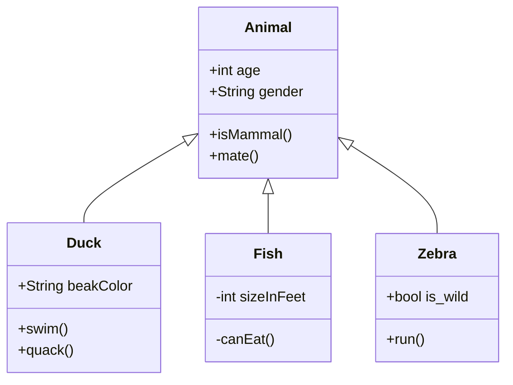

# 设计模式

> 设计模式的母的：
>
> - 代码重用性
> - 可读性
> - 可扩展性
> - 可靠性
> - 使程序呈现高内聚、低耦合

**类与类之间的关系： 依赖、泛化（继承）、实现、关联、集合、组合**

**策略模式**：定义算法族，并将其封装起来，使算法变化独立与用户，将行为与对象分开。

优点：算法自由切换、避免使用多重条件判断、扩展性良好

缺点：策略类会增多、所有策略都需要对外暴露

使用场景：基准指数计算，筛选增加条件


## 设计原则（七大原则）：

**职责单一原则**： 每个类都应该只有一个单一的功能，并且该功能应该由这个类完全封装起来。

**接口隔离原则**： 接口的方法尽量少，面向接口编程，对修改关闭，对扩展开放。

**依赖倒转原则**： a.高层模块不应该依赖低层模块， 都应该依赖抽象 b. 细节依赖抽象

**里氏替换原则**： 子类必须能替换父类

**开闭原则**：对扩展开放，对修改关闭

迪米特法则：

合成复用原则：


**类图**： (`````mermaid ``)初始化空白图， 语法解释：`<|--` 表示继承，`+` 表示 `public`，`-` 表示 `private`，学过 Java 的应该都知道。 

[UML语法参考](https://my.oschina.net/u/4589216/blog/4427759)

[代码&UML参考](https://github.com/mxg133/learnforJava_DesignPattern)





### 单一职责原则

> Single Responsibility Principle

**优点：** 

● 类的复杂性降低，实现什么职责都有清晰明确的定义；

● 可读性提高，复杂性降低，那当然可读性提高了； 

● 可维护性提高，可读性提高，那当然更容易维护了； 

● 变更引起的风险降低，变更是必不可少的，如果接口的单一职责做得好，一个接口修改只对相应的实现类有影响，对其他的接口无影响，这对系统的扩展性、维护性都有非常大的帮助。

ps：接口一定要做到单一职责，类的设计尽量做到只有一个原因引起变化。

​    单一职责原则提出了一个编写程序的标准，用“职责”或“变化原因”来衡量接口或类设计得是否优良，但是“职责”和“变化原因”都是不可度量的，因项目而异，因环境而异。

### 接口隔离原则

> Interface Segregation Principle

接口分为两种：

实例接口（Object Interface）：Java中的类也是一种接口

类接口（Class Interface）： Java中经常使用Interface关键字定义的接口

隔离：建立单一接口，不要建立臃肿庞大的接口；即接口要尽量细化，同时接口中的方法要尽量少。

接口隔离原则与单一职责原则的不同：接口隔离原则与单一职责的审视角度是不相同的，单一职责要求的是类和接口职责单一，注重的是职责，这是业务逻辑上的划分，而接口隔离原则要求接口的方法尽量少。

### 依赖倒置原则

> Dependence Inversion Principle

**原始定义：**

①高层模块不应该依赖低层模块，两者都应该依赖其抽象； 

②抽象不应该依赖细节（实现类）； 

③细节应该依赖抽象。

**依赖倒置原则在java语言中的体现：**

①模块间的依赖通过抽象发生，实现类之间不发生直接的依赖关系，其依赖关系是通过接口或抽象类产生的；

②接口或抽象类不依赖于实现类；

③实现类依赖接口或抽象类。

**依赖的三种写法**：

①构造函数传递依赖对象（构造函数注入）

②Setter方法传递依赖对象（setter依赖注入）

③接口声明依赖对象（接口注入）

**使用原则：**

依赖倒置原则的本质就是通过抽象（接口或抽象类）使各个类或模块的实现彼此独立，不互相影响，实现模块间的松耦合，我们怎么在项目中使用这个规则呢？只要遵循以下的几个规则就可以：

①每个类尽量都有接口或抽象类，或者抽象类和接口两者都具备

②变量的表面类型尽量是接口或者是抽象类

③任何类都不应该从具体类派生（只要不超过两层的继承是可以忍受的）

④尽量不要复写基类的方法

⑤结合里氏替换原则使用

 


### 里氏替换原则

> Liskov Substitution Principle

定义：Functions that use pointers or references to base classes must be able to use objects of derived classes without knowing it.

（所有引用基类的地方必须能透明地使用其子类的对象。）

通俗点讲，只要父类能出现的地方子类就可以出现，而且替换为子类也不会产生任何错误或异常，使用者可能根本就不需要知道是父类还是子类。但是，反过来就不行了，有子类出现的地方，父类未必就能适应。

定义中包含的四层含义：

**1.子类必须完全实现父类的方法**

**2.子类可以有自己的个性**

**3.覆盖或实现父类的方法时输入参数可以被放大**

​    如果父类的输入参数类型大于子类的输入参数类型，会出现父类存在的地方，子类未必会存在，因为一旦把子类作为参数传入，调用者很可能进入子类的方法范畴。

 **4. 覆写或实现父类的方法时输出结果可以被缩小**

​    父类的一个方法的返回值是一个类型T，子类的相同方法（重载或覆写）的返回值为S，那么里氏替换原则就要求S必须小于等于T，也就是说，要么S和T是同一个类型，要么S是T的子类。


 

### 开闭原则

> Open Closed Principle

**定义：**软件实体应该对扩展开放，对修改关闭。

其含义是说一个软件实体应该通过扩展来实现变化，而不是通过修改已有的代码来实现变化。

**软件实体：**项目或软件产品中按照一定的逻辑规则划分的模块、抽象和类、方法。

**变化的三种类型：**

①逻辑变化 

只变化一个逻辑，而不涉及其他模块，比如原有的一个算法是a*b+c，现在需要修改为a*b*c，可以通过修改原有类中的方法的方式来完成，前提条件是所有依赖或关联类都按照相同的逻辑处理。

②子模块变化 

一个模块变化，会对其他的模块产生影响，特别是一个低层次的模块变化必然引起高层模块的变化，因此在通过扩展完成变化时，高层次的模块修改是必然的。

③可见视图变化

可见视图是提供给客户使用的界面，如JSP程序、Swing界面等，该部分的变化一般会引起连锁反应（特别是在国内做项目，做欧美的外包项目一般不会影响太大）。可以通过扩展来完成变化，这要看我们原有的设计是否灵活。

 

### 迪米特法则


### 合成服用原则


## 创建型模式

创建型模式的作用就是创建对象，说到创建一个对象，最熟悉的就是 new 一个对象，然后 set 相关属性。但是，在很多场景下，我们需要给客户端提供更加友好的创建对象的方式，尤其是那种我们定义了类，但是需要提供给其他开发者用的时候。

工厂模式分为简单工厂模式，工厂模式，抽象工厂模式

在工厂模式中，我们在创建对象时不会对客户端暴露创建逻辑，并且是通过使用一个共同的接口来指向新创建的对象。**本质就是使用工厂方法代替new操作。**

### 简单工厂模式

```java
public class FoodFactory {

    public static Food makeFood(String name) {
        if (name.equals("兰州拉面")) {
            Food noodle = new LanZhouNoodle();
            System.out.println("兰州拉面"+noodle+"出锅啦");
            return noodle;
        } else if (name.equals("黄焖鸡")) {
            Food chicken = new HuangMenChicken();
            System.out.println("黄焖鸡"+ chicken +"出锅啦");
            return chicken;
        } else {
            System.out.println("不知道你做的什么哦~");
            return null;
        }
    }
}
```

 *其中，LanZhouNoodle 和 HuangMenChicken 都继承自 Food。* 

```java
public class Cook {
    public static void main(String[] args) {
        Food food = FoodFactory.makeFood("黄焖鸡");
        FoodFactory.makeFood("jaja");
    }
}
```

简单地说，**简单工厂模式通常就是这样，一个工厂类 XxxFactory，里面有一个静态方法，根据我们不同的参数，返回不同的派生自同一个父类（或实现同一接口）的实例对象。**

> 我们强调**职责单一**原则，一个类只提供一种功能，FoodFactory 的功能就是只要负责生产各种 Food。

在此例中可以看出，Cook 类在使用 FoodFactory 时就不需要 new 任何一个对象，这就是简单工厂模式的好处，封装了 new 的部分，做到的代码易用性。

### 工厂模式

```mermaid
classD
```


简单工厂模式很简单，如果它能满足我们的需要，我觉得就不要折腾了。之所以需要引入工厂模式，是因为我们往往需要使用两个或两个以上的工厂。

```java
public interface FoodFactory {
    Food makeFood(String name);
}
public class ChineseFoodFactory implements FoodFactory {

    @Override
    public Food makeFood(String name) {
        if (name.equals("A")) {
            return new ChineseFoodA();
        } else if (name.equals("B")) {
            return new ChineseFoodB();
        } else {
            return null;
        }
    }
}
public class AmericanFoodFactory implements FoodFactory {

    @Override
    public Food makeFood(String name) {
        if (name.equals("A")) {
            return new AmericanFoodA();
        } else if (name.equals("B")) {
            return new AmericanFoodB();
        } else {
            return null;
        }
    }
}
```

其中，ChineseFoodA、ChineseFoodB、AmericanFoodA、AmericanFoodB 都派生自 Food。

客户端调用：

```java
public class APP {
    public static void main(String[] args) {
        // 先选择一个具体的工厂
        FoodFactory factory = new ChineseFoodFactory();
        // 由第一步的工厂产生具体的对象，不同的工厂造出不一样的对象
        Food food = factory.makeFood("A");
    }
}
```

虽然都是调用 makeFood("A")  制作 A 类食物，但是，不同的工厂生产出来的完全不一样。

第一步，我们需要选取合适的工厂，然后第二步基本上和简单工厂一样。

**核心在于，我们需要在第一步选好我们需要的工厂**。比如，我们有 LogFactory 接口，实现类有 FileLogFactory 和 KafkaLogFactory，分别对应将日志写入文件和写入 Kafka 中，显然，我们客户端第一步就需要决定到底要实例化 FileLogFactory 还是 KafkaLogFactory，这将决定之后的所有的操作。

### 抽象工厂模式

当涉及到**产品族**的时候，就需要引入抽象工厂模式了。 一个经典的例子是造一台电脑 。

当涉及到这种产品族的问题的时候，就需要抽象工厂模式来支持了。我们不再定义 CPU 工厂、主板工厂、硬盘工厂、显示屏工厂等等，我们直接定义电脑工厂，每个电脑工厂负责生产所有的设备，这样能保证肯定不存在兼容问题。 

当然，抽象工厂的问题也是显而易见的，比如我们要加个显示器，就需要修改所有的工厂，给所有的工厂都加上制造显示器的方法。这有点违反了**对修改关闭，对扩展开放**这个设计原则。 

### 单例模式

简单点说，就是一个应用程序中，某个类的实例对象只有一个，你没有办法去new，因为构造器是被private修饰的，一般通过getInstance()的方法来获取它们的实例。

getInstance()的返回值是一个对象的引用，并不是一个新的实例，所以不要错误的理解成多个对象。

**特点**

- 类构造器私有
- 持有自己类型的属性
- 对外提供获取实例的静态方法

**饿汉式写法** 

```java
public class Singleton {  
   private static Singleton instance = new Singleton();  
   private Singleton (){}  
   public static Singleton getInstance() {  
   return instance;  
   }  
}
```

 弊端：因为类加载的时候就会创建对象，所以有的时候还不需要使用对象，就会创建对象，造成内存的浪费； 

**饱汉模式最容易出错：**

```java
public class Singleton {
    // 首先，也是先堵死 new Singleton() 这条路
    private Singleton() {}
    // 和饿汉模式相比，这边不需要先实例化出来，注意这里的 volatile，它是必须的
    private static volatile Singleton instance = null;

    public static Singleton getInstance() {
        if (instance == null) {
            // 加锁
            synchronized (Singleton.class) {
                // 这一次判断也是必须的，不然会有并发问题
                if (instance == null) {
                    instance = new Singleton();
                }
            }
        }
        return instance;
    }
}
```

> 双重检查，指的是两次检查 instance 是否为 null。
>
> volatile 在这里是需要的，希望能引起读者的关注。
>
> 很多人不知道怎么写，直接就在 getInstance() 方法签名上加上 synchronized，这就不多说了，性能太差。

嵌套类最经典，以后大家就用它吧：

```java
public class Singleton {

    private Singleton() {}
    // 主要是使用了 嵌套类可以访问外部类的静态属性和静态方法 的特性
    private static class Holder {
        private static Singleton instance = new Singleton();
    }
    public static Singleton getInstance() {
        return Holder.instance;
    }
}
```

> 注意，很多人都会把这个**嵌套类**说成是**静态内部类**，严格地说，内部类和嵌套类是不一样的，它们能访问的外部类权限也是不一样的。

最后，我们说一下枚举，枚举很特殊，它在类加载的时候会初始化里面的所有的实例，而且 JVM 保证了它们不会再被实例化，所以它天生就是单例的。

**TODO:** 

建造者模式

原型模式

## 结构型模式

前面创建型模式介绍了创建对象的一些设计模式，这节介绍的结构型模式旨在通过改变代码结构来达到解耦的目的，使得我们的代码容易维护和扩展。


### 代理模式

第一个要介绍的代理模式是最常使用的模式之一了，用一个代理来隐藏具体实现类的实现细节，通常还用于在真实的实现的前后添加一部分逻辑。

既然说是**代理**，那就要对客户端隐藏真实实现，由代理来负责客户端的所有请求。当然，代理只是个代理，它不会完成实际的业务逻辑，而是一层皮而已，但是对于客户端来说，它必须表现得就是客户端需要的真实实现。

理解**代理**这个词，这个模式其实就简单了。 下面上代码理解。
代理接口：

```java
//要有一个代理接口让实现类和代理实现类来实现。
public interface FoodService {
    Food makeChicken();
}
```

被代理的实现类：

```java
public class FoodServiceImpl implements FoodService {
    @Override
    public Food makeChicken() {
        Food f = new Chicken();
        f.setChicken("1kg");
        f.setSpicy("1g");
        f.setSalt("3g");
        System.out.println("鸡肉加好佐料了");
        return f;
    }
}

```

被代理实现类就只需要做自己该做的事情就好了，不需要管别的。

代理实现类：

```java
public class FoodServiceProxy implements FoodService {
    // 内部一定要有一个真实的实现类，当然也可以通过构造方法注入
    private FoodService foodService = new FoodServiceImpl();
    
    @Override
    public Food makeChicken() {
        System.out.println("开始制作鸡肉");
        
        // 如果我们定义这句为核心代码的话，那么，核心代码是真实实现类做的，
        // 代理只是在核心代码前后做些“无足轻重”的事情
        Food food = foodService.makeChicken();
        
        System.out.println("鸡肉制作完成啦，加点胡椒粉");
        food.addCondiment("pepper");
        System.out.println("上锅咯");
        return food;
    }
}

```

 客户端调用，注意，我们要用代理来实例化接口： 

```java
// 这里用代理类来实例化
FoodService foodService = new FoodServiceProxy();
foodService.makeChicken();

```

所谓代理模式，**就是对被代理方法包装或者叫增强， 在面向切面编程（AOP）中，其实就是动态代理的过程。比如 Spring 中，我们自己不定义代理类，但是 Spring 会帮我们动态来定义代理，然后把我们定义在 @Before、@After、@Around 中的代码逻辑动态添加到代理中。** 


待续。。。

## 行为型模式

### 模板模式

 在含有继承结构的代码中，模板方法模式是非常常用的。 

**父类定义了骨架（调用哪些方法及顺序），某些特定方法由子类实现**

模板方法只负责定义第一步应该要做什么，第二步应该做什么，第三步应该做什么，至于怎么做，由子类来实现。 

好处：代码复用，减少重复代码。除了子类要实现的特定方法，其他方法及方法调用顺序都在父类中预先写好 

缺点：   每一个不同的实现都需要一个子类来实现，导致类个数增加，使系统更加庞大 

**模板模式的关键点：**

　　　　1、使用抽象类定义模板类，并在其中定义所有的基本方法、模板方法，钩子方法，不限数量，以实现功能逻辑为主。其中基本方法使用final修饰，其中要调用基本方法和钩子方法，基本方法和钩子方法可以使用protected修饰，表明可被子类修改。

　　　　2、定义实现抽象类的子类，重写其中的模板方法，甚至钩子方法，完善具体的逻辑。

　　使用场景：

　　　　1、在多个子类中拥有相同的方法，而且逻辑相同时，可以将这些方法抽出来放到一个模板抽象类中。

　　　　2、程序主框架相同，细节不同的情况下，也可以使用模板方法。

#### 架构方法介绍

模板方法使得子类可以在不改变算法结构的情况下，重新定义算法中的某些步骤。其主要分为两大类：模版方法和基本方法，而基本方法又分为：抽象方法（Abstract Method），具体方法（Concrete Method），钩子方法（Hook Method）。 

四种方法的基本定义（前提：在抽象类中定义）： 

（1）抽象方法：由抽象类声明，由具体子类实现，并以abstract关键字进行标识。 

（2）具体方法：由抽象类声明并且实现，子类并不实现或者做覆盖操作。其实质就是普遍适用的方法，不需要子类来实现。 

（3）钩子方法：由抽象类声明并且实现，子类也可以选择加以扩展。通常抽象类会给出一个空的钩子方法，也就是没有实现的扩展。**它和具体方法在代码上没有区别，不过是一种意识的区别**；而它和抽象方法有时候也是没有区别的，就是在子类都需要将其实现的时候。而不同的是抽象方法必须实现，而钩子方法可以不实现。也就是说钩子方法为你在实现某一个抽象类的时候提供了可选项，**相当于预先提供了一个默认配置。** 

（4）模板方法：定义了一个方法，其中定义了整个逻辑的基本骨架。

```java
public abstract class AbstractTemplate {
    // 这就是模板方法
    public void templateMethod() {
        init();
        apply(); // 这个是重点
        end(); // 可以作为钩子方法
    }
	//这是具体方法
    protected void init() {
        System.out.println("init 抽象层已经实现，子类也可以选择覆写");
    }

    // 这是抽象方法，留给子类实现
    protected abstract void apply();
	//这是钩子方法，可定义一个默认操作，或者为空
    protected void end() {
    }
}

```


